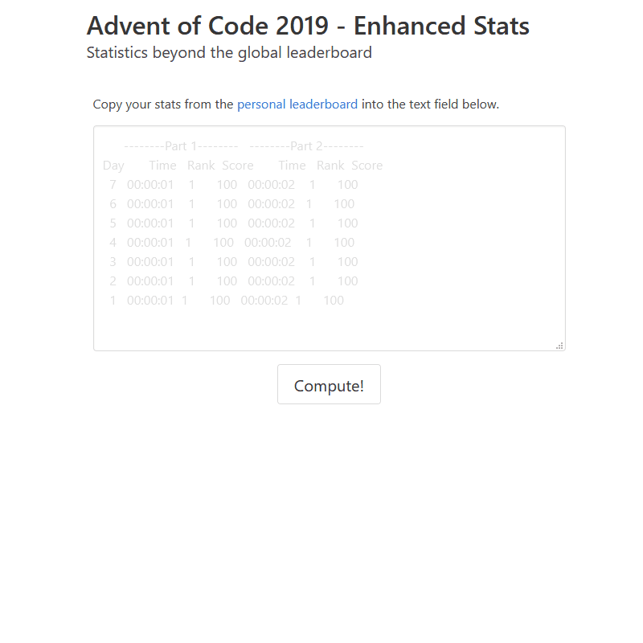

# adventofcode-percenter

Generate some basic graphs & find how you're doing overall (Top X%) for each day and solution. This is super basic honestly.

You can use it from https://aocstats.marcolussetti.com

## Demo

## Contributing
If for any reason you feel compelled to contribute, pull requests are of course very welcome. For major changes, please open an issue first to discuss what you would like to change.

When merged in, changes get autodeployed from master via Netlify.

## License
[MIT](https://choosealicense.com/licenses/mit/)
